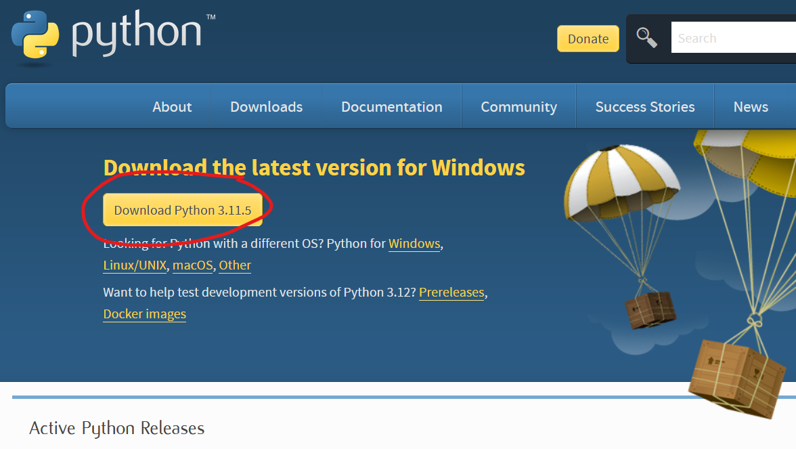
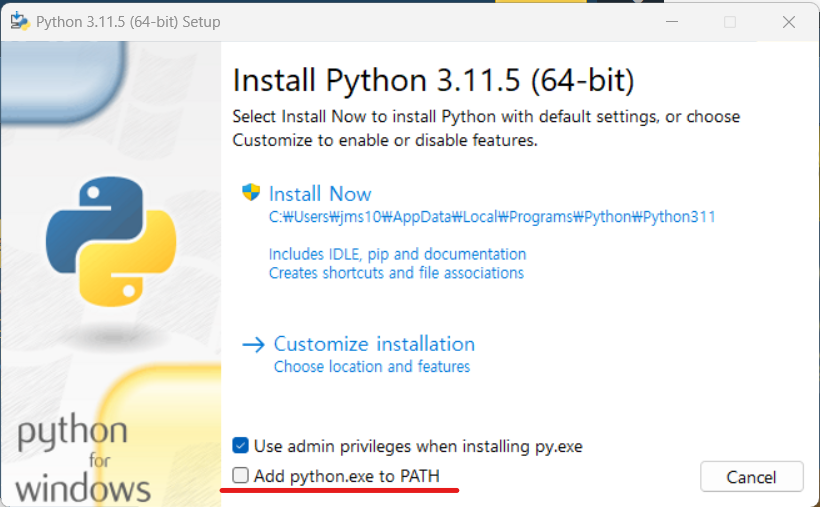
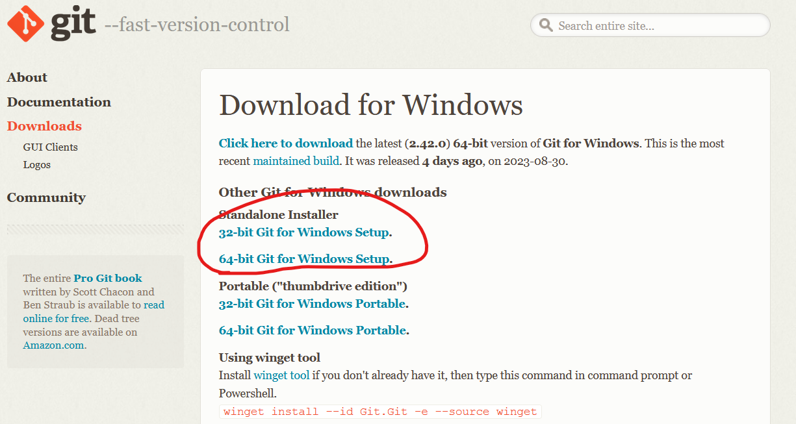
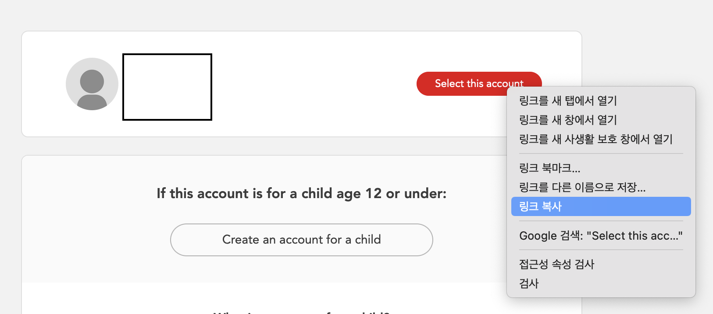

s3s 초보자 한국어 가이드 (2023.09.03) 🦑🔰🇰🇷
=====

**s3s**는 SplatNet3(닌텐도 스위치 온라인 앱)의  _Splatoon 3_ 배틀 데이터를 [stat.ink](https://stat.ink/)로 업로드 해주는 스크립트입니다. 여기서 [stat.ink](https://stat.ink/)는 스플래툰 시리즈의 전적을 기록하고 통계를 보여 주는 서비스입니다. 다른 게임의 전적 서비스와는 달리, stat.ink는 홈페이지에서 자신의 전적을 직접 갱신 할 수 없습니다. 이는 닌텐도에서 배틀 데이터를 공개적으로 제공하고 있지 않기 때문인데요. 따라서 전적 서비스를 이용하기 위해서는 유저가 직접 전적을 업로드해서 갱신해주어야만 합니다. 이를 도와주는 스크립트가 **s3s**입니다.

이 가이드는 프로그래밍 언어에 익숙하지 않은 한국어 사용자를 위해 작성되었습니다. 더 자세한 사용법과 설명은 [s3s 레포지토리](https://github.com/frozenpandaman/s3s)의 README.md 를 참조해주세요.

아래 가이드에서 문제가 생겼을 때 한국어로 질문하고 싶으시다면, 이 레포지토리에 이슈를 생성해주세요! 영어가 가능하신 분이라면 직접 [원작자 s3s 레포지토리에](https://github.com/frozenpandaman/s3s) 가셔서 이슈를 만들어주셔도 됩니다.

## 설치 및 설정 (Windows 유저) ⚙

### 1. 파이썬 및 Git 설치

먼저 Python 3를 다운받고 설치해 줍니다. [Python.org](https://www.python.org/downloads/)의 최신 버전을 다운 받고, "Add python.exe to PATH"(중요!)라는 옵션을 체크해 설치를 진행합니다.

[Git](https://git-scm.com/download/)을 설치합니다. 설치 중에 여러가지 물어보는 옵션이 많으나 크게 신경쓰지 않고 전부 Next를 눌러도 무방합니다.

### 2. Windows Powershell 실행

Windows Powershell은 Windows의 명령어 라인 인터페이스입니다. 저희는 이 powershell 위에서 방금 설치한 python, git을 사용해 s3s를 실행할 예정입니다.

실행 방법:

1. Windows 시작 메뉴를 엽니다.
2. 검색창에 "Powershell"을 입력하고 검색합니다.
3. 나타나는 결과 중 "Windows Powershell"을 클릭하여 실행합니다.

### 3. s3s 다운로드 및 초기 설정

1. 앞서 실행한 Powershell에, `git clone https://github.com/frozenpandaman/s3s.git`을 입력하여 s3s를 다운받습니다.

2. 먼저 다운받은 폴더(s3s/)로 들어가야 합니다. `cd s3s/`를 입력해 s3s 폴더로 들어가 주세요!

3. `python -m pip install -r requirements.txt`을 입력해 s3s가 필요로하는 파이썬 라이브러리를 설치합니다.

4. `python s3s.py -r`를 입력해 s3s를 실행합니다. 처음 실행한 s3s는 가장 먼저 stat.ink의 API 키를 요구합니다. (API 키는 stat.ink의 [프로필 설정 페이지](https://stat.ink/profile)에서 확인할 수 있습니다). locale을 설정하라는 질문에는 `ko-KR`을 입력해 주세요.

    참고: 여기서 더 진행하기 전에 "토큰 생성" 탭을 읽어주세요. [#토큰 생성](#토큰-생성-)

5. 이후에는 닌텐도 홈페이지의 링크와 함께, 로그인 후 "Select this account" 버튼의 링크를 붙여 넣으라는 설명이 나옵니다. 이는 `gtoken`과 `bulletToken`이라는 특수한 토큰을 생성하기 위한 절차입니다. 만약 당신이 자동 토큰 생성을 사용하고 싶지 않다면, "skip"을 입력해 주세요. 대신에 수동 생성한 토큰을 입력할 수 있습니다. ([mitmproxy instructions(영어)](https://github.com/frozenpandaman/s3s/wiki/mitmproxy-instructions)).

6. 이제 생성한 토큰 그리고 stat.ink API 키 그리고 로케일 등이 `config.txt`에 저장되었습니다! 이제 모든 준비는 끝났습니다!

## 사용법 🐙

설치 및 설정이 완료되면, 언제든지 s3s 폴더 내에서(powrshell을 다시 켤 때마다, `cd s3s/`를 실행해주어야 한다는 사실을 잊지 마세요!) s3s를 실행할 수 있습니다.

`python s3s.py (+원하는 옵션들)`

- `-M [숫자]` M 옵션은 s3s를 모니터링 모드로 실행합니다. `-M 60`이라는 옵션을 지정할 경우, 주기적으로 1분(60초)마다 배틀결과를 체크해서, 새로운 결과가 추가되었다면 이를 업로드합니다. 만약 숫자 없이 `-M`만 입력할 수도 있는데, 이때의 기본값은 5분(300초) 입니다.

- `-r` r 옵션은 지금 업로드할 내용이 SplatNet3에 이미 업로드되어 있는지 체크합니다. 간단하게 말해서 중복 업로드 방지 기능입니다.

- `-nsr` nsr 옵션은 새먼런 결과를 업로드에서 제외하고 싶을 때 사용합니다. 오직 배틀 전적만 업로드하고 싶을 때 사용할 수 있습니다.

- `-osr` osr 옵션은 반대로 새먼런 결과만을 업로드할 때 사용할 수 있습니다.

- `--blackout` blackout 옵션을 사용하면, 전적 데이터에서 다른사람의 이름이 익명처리됩니다.

ex)
- `python s3s.py -r -nsr`  (배틀만 중복없이 업로드)
- `python s3s.py -M 600 -r --blackout`  (익명처리해서 600초마다 한번씩 중복없이 업로드)
- `python s3s.py -r -osr --blackout`  (익명처리해서 새먼런만 중복없이 업로드)

## 토큰 생성 🪙

(토큰 생성 챕터는 [영어 원문](https://github.com/frozenpandaman/s3s#token-generation-)을 그대로 번역하였습니다. 오역/의역이 많으니 감안하고 읽어주세요!)

s3s가 작동하기 위해서는 SplatNet에 접근할 수 있게 해주는 `gtoken`과 `bulletToken`이 필요합니다. 이 토큰들은 스크립트를 통해 자동으로 얻을 수도 있고, 아니면 공식 닌텐도 스위치 온라인 앱을 통해 수동으로 얻을 수도 있습니다. 아래의 가이드를 먼저 읽고, 토큰 생성 방식을 신중하게 선택해 주세요.

### 자동 생성

자동으로 토큰을 생성하는 과정에서 *공식 닌텐도 서버가 아닌 제 3의 서버와의 통신 (최소한의 정보만을 포함해 안전하게 진행됩니다)* 을 합니다. s3s는 최대한 투명하게 이 과정을 공개하고, 보안과 프라이버시에 대해 심도있는 정보를 제공하려 노력하고 있습니다. 또한 자동 생성 과정이 조금 꺼림칙하게 느껴지신다면 수동으로 토큰을 얻을 수 있습니다.

**프라이버시 안내:** 개인을 식별할 수 있는 어떠한 정보도 [imink API (언급한 제3의 서버)](https://status.imink.app/)로 전송되지 않습니다. 유저 ID와 비밀번호는 imink API와는 동떨어진 곳에 존재하고, 당신 이외에는 그 누구도 접근할 수 없습니다. API가 반환하는 결과값 또한 당신의 계정에 대한 의미있는 정보를 담고 있지 않습니다. 또한 전송되거나 저장된 데이터를 사용하여 어떤 계정/유저가 요청을 수행했는지 식별하거나, 유저에 대한 개인 정보를 확인하거나, 계정에 대한 접근 권한을 얻을 수 없습니다. 자세한 내용은 [imink API Privacy Policy](https://github.com/JoneWang/imink/wiki/Privacy-Policy)와 [Documentation](https://github.com/JoneWang/imink/wiki/imink-API-Documentation)을 참조해주세요.

대안으로 [nsotokengen](https://github.com/clovervidia/nsotokengen)나 [nxapi-znca-api](https://github.com/samuelthomas2774/nxapi-znca-api)를 사용할 수 있습니다. 이들을 사용하면 외부 통신 없이 사용자 컴퓨터에서 토큰을 생성하는 것이 가능합니다. 생성 후에는 `config.txt`를 직접 수정해 반영할 수 있습니다. (이 과정에서는 루팅한 안드로이드 폰 또는 안드로이드 에뮬레이터가 필요합니다)

### 수동 생성

자동 토큰 생성을 사용하지 않기로 결정한 사용자는 SplatNet 3를 통해 수동으로 토큰을 가져와야합니다.

이 경우, 사용자는 자신의 폰(혹은 에뮬레이터)에서 기기의 웹 트래픽을 가로채서 토큰을 얻어야 하고, 이 토큰을 s3s에 입력해야합니다. (혹은 수동으로 `config.txt`에 추가) [mitproxy instructions(영어)](https://github.com/frozenpandaman/s3s/wiki/mitmproxy-instructions)의 가이드를 참조해주세요. 수동으로 s3s에 토큰을 입력하려면, s3s에 "Select this account" URL을 입력해야할 때 "skip"을 입력하세요.
